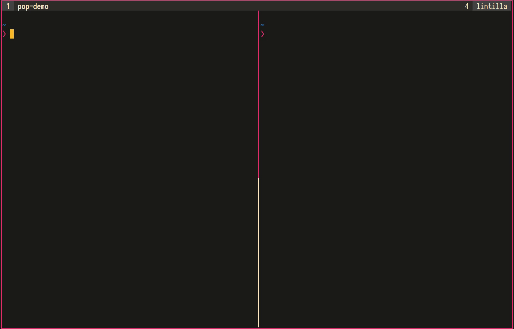

# Tmux-pop

tmux-pop is a tiny TMUX plugin that flashes the active pane with a given color on move.



## Installation

### Using [Tmux Plugin Manager](https://github.com/tmux-plugins/tpm) (recommended)

```
set -g @plugin 'roosta/tmux-pop'
```

### Manually
```shell
git clone https://github.com/roosta/tmux-pop
```

Add this to the bottom of `.tmux.conf`
```
run-shell ~/path/to/repo/tmux_pop.tmux
```

Reload TMUX env
```shell
tmux source-file ~/.tmux.conf
```

## Options
tmux-pop defaults to using `brightblack` as the pop color, but it can be changed
in `.tmux.conf`

```
set -g @tmux-pop-color 'red'
```

The choice of color are limited to what is defined in `message-command-style` in tmux:
> The colour is one of: black, red, green, yellow, blue, magenta, cyan, white, aixterm bright variants (if supported: brightred,
> brightgreen, and so on), colour0 to colour255 from the 256-colour set, default, or a hexadecimal RGB string such as ‘#ffffff’.

## Tips
tmux-pop works by temporarily changing the terminal background, for this to work in say `vim`, you'd need a colorscheme that allows the background color to pass through. Plug: Srcery [Vim](https://github.com/srcery-colors/srcery-vim) and [Emacs](https://github.com/srcery-colors/srcery-emacs) themes supports transparent background.
